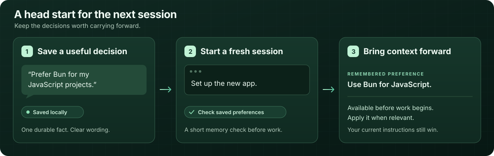
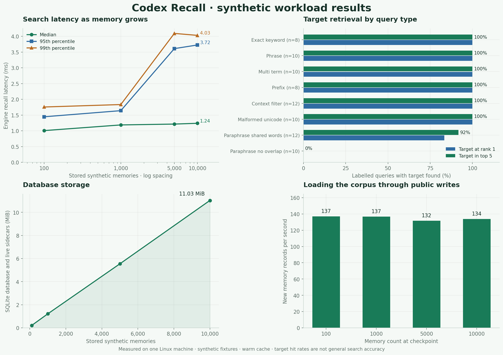

<p align="center">
  
</p>

<p align="center">
  <a href="https://github.com/christianfurr/codex-recall/actions/workflows/ci.yml"></a>
  
  
  
  
  
  
</p>

# Codex Recall

**Give your next Codex session a head start.**

Your package manager preference. The reason a project uses SQLite. The fix that finally solved a recurring setup problem. Codex Recall keeps these small, useful facts available after the conversation ends, so you spend less time explaining the same decisions again.

Install it once, start a new Codex session, and tell Codex what is worth remembering. The installed guidance asks Codex to check a short list of preferences and project memories before substantial work, then search for context relevant to the task. Saved facts become starting context for the next session.

<p align="center">
  
</p>

| What you save | How it helps the next task |
| --- | --- |
| “I prefer Bun for JavaScript projects.” | Codex can see your package manager preference before setting up a project. |
| “This project uses SQLite because it must work offline.” | Later work has the reason behind the architecture, as well as the choice. |
| “Run tests in the repository's `.venv`.” | A later session can recover the setup convention before running commands. |
| “The authentication refactor is waiting on the schema migration.” | A new session can recover a durable checkpoint and verify it against the current code. |

**Local storage. Small context. Your control.** Codex starts a Python MCP process when needed; selected facts live in a private SQLite database. No always-running daemon, model download, embedding service, telemetry, or API key is required. You can browse, correct, replace, or delete memories.

Memory is selective. The service does not ingest conversations or scan your files automatically. Codex still decides what is relevant and how to use it; current instructions take precedence over remembered context.

Want Codex to use a saved website login or an approved administrator command? The optional [saved login companion](docs/credentials.md) keeps credentials in your Linux keyring and lets Codex request actions by name.

[Get started](#getting-started) · [See the daily workflow](#daily-use) · [Saved logins](#saved-logins-and-approved-administrator-actions) · [How it helps Codex](#how-it-helps-codex)

## Getting started

Requires Ubuntu/Linux, Python 3.10+, SQLite with FTS5, and an installed Codex CLI with MCP support. Installation uses an isolated `.venv`, exact pinned dependencies, and no sudo. Dependency installation requires access to PyPI or a populated local package cache; normal memory service operation needs no network.

```bash
git clone https://github.com/christianfurr/codex-recall.git
cd codex-recall
./install.sh
```

The installer checks Python and FTS5, installs the package, initializes secure storage, backs up existing Codex configuration and global instructions, registers `local_memory`, and checks health. Re-running it preserves stored memories and avoids duplicate registration or guidance. Unrelated Codex settings and MCP servers are preserved.

**Start a new Codex session after installation.** Existing sessions may retain their original tool list. Other AI applications need their own MCP connection.

Check the registration and database:

```bash
codex mcp get local_memory
.venv/bin/python -m codex_memory.maintenance status
```

A healthy status reports `accessible: true`, `integrity: "ok"`, `fts_integrity: "ok"`, and `fts5_available: true`. The command exits nonzero if those checks fail.

## Daily use

Use ordinary language. Save the decision and its reason when it will matter again:

> Remember that I prefer Bun over npm for my JavaScript projects.

> Remember for this project: keep SQLite because the app must work offline.

Then start a new session and work normally. The installed guidance asks Codex to load up to three global preferences and five project memories once before the session's first substantial task. It then uses a small keyword search for relevant details, with one shorter retry when needed. This gives the session useful starting context without pulling your whole memory database into every task.

The installer adds this workflow to [Codex's global startup guidance](https://learn.chatgpt.com/docs/agent-configuration/agents-md). Start a new session after installing or updating so the guidance takes effect.

You can also ask explicitly:

> Check my remembered preferences, then create a Next.js project.

> What do you remember about this project's storage decisions?

> Replace the old package manager decision with pnpm for this project.

Good memories are confirmed preferences, decisions, important fixes, and stable setup facts. Include distinctive words such as `Bun`, `SQLite`, or the component name so a later search can find them. Avoid transient chatter, command logs, secrets, guesses, and information already easy to discover in the repository. Verify old facts against the current machine and code before relying on them.

<details>
<summary>What the MCP calls look like</summary>

The preference example uses these tool calls:

```json
{
  "tool": "remember",
  "arguments": {
    "content": "Prefers Bun over npm for JavaScript projects.",
    "category": "preferences",
    "scope": "global",
    "source": "Explicit user preference"
  }
}
```

```json
{
  "tool": "recall",
  "arguments": {
    "query": "bun",
    "project": "/home/you/Code/my-app",
    "limit": 5
  }
}
```

Saved memories have stable IDs, provenance, UTC timestamps, optional expiration, and explicit supersession links. The installed guidance also asks Codex to consider saving confirmed durable information after substantial work.

</details>

## Saved logins and approved administrator actions

Enable the separate `local_credentials` companion when you want Codex to sign in to a saved site or run a specific administrator action you have approved. It adds five action tools and keeps the six memory tools unchanged.

Run setup in **your own interactive terminal** with an existing, unlocked Linux Secret Service keyring:

```bash
./install.sh --credentials
.venv/bin/codex-recall-credentials add github --url https://github.com/login
.venv/bin/codex-recall-credentials add machine-sudo --sudo
.venv/bin/codex-recall-credentials allow machine-sudo check-host -- /usr/bin/id
```

Username and password prompts are hidden. Passwords stay out of command arguments, memory records, and MCP responses. Start a new Codex session, then ask:

> Sign in to GitHub using the saved github login.

> Run the approved check-host action using machine-sudo.

Website login uses a separate, visible Chromium profile and submits supported HTTPS login forms on the saved origin. Finish MFA or passkeys yourself in that browser; submission alone does not confirm authentication. Sudo runs only the saved command and arguments, returning its status while discarding its output. Codex cannot add credentials or approve new commands through MCP.

The browser makes network requests. Its request guards are not a comprehensive firewall; the website's JavaScript is trusted with the submitted login. Approved programs retain their root capabilities, including loading files, configuration, and helpers. Your OS keyring and private browser files also remain accessible to sufficiently privileged local processes.

[Setup, tools, limits, and removal](docs/credentials.md) · [Security details](SECURITY.md)

Verified with **159 passing local tests**, including eight real Chromium tests with synthetic login pages, a synthetic round trip through the system keyring, and discovery of all five tools through Codex itself. [What was tested](docs/credentials-verification.md).

## Six memory tools

| Tool | Purpose | Inputs |
| --- | --- | --- |
| `remember` | Save a validated fact; compatible exact duplicates return the existing ID. | Required `content`, `category`, `scope`; optional `project`, `source`, `expires_at`. |
| `recall` | Search keywords, phrases, and prefixes with BM25 ranking. | Required `query`; optional `scope`, `project`, `category`, `limit`, `include_superseded`. |
| `update_memory` | Correct content or metadata while keeping the original ID and creation time. | Required `id`; optional `content`, `category`, `scope`, `project`, `source`, `expires_at`, `status`, `superseded_by`. |
| `forget` | Permanently delete an ID from the active database and search index. | Required `id`; nonexistent IDs return `deleted: false`. |
| `list_memories` | Browse newest updates with pagination. | Optional `category`, `scope`, `project`, `limit`, `offset`, `include_superseded`. |
| `memory_status` | Check integrity, FTS5, versions, counts, and storage size. | No inputs. |

Categories: `preferences`, `machine_setup`, `project_decisions`, `task_progress`, `lessons_learned`, `development_conventions`, `technical_context`, and `general`.

Both recall and listings default to 5 results and cap requests at 10. An administrator can explicitly change the cap with the server's `--max-results` argument, up to 100. Expired records are excluded even when `include_superseded` is true. Expiration accepts ISO 8601 timestamps with a timezone, such as `2027-01-01T00:00:00Z`.

### Scopes and projects

| Scope | Intended context |
| --- | --- |
| `global` | Preferences and conventions across projects. |
| `machine` | Facts about the computer using this database. |
| `project` | Decisions and progress for one specific project; requires `project`. |

Without a project filter, retrieval includes global and machine memories only. With `project`, it includes that project plus global and machine context; unrelated projects are excluded. Set `scope: "project"` with `project` to retrieve only that project's records, or `scope: "global"` / `"machine"` to narrow to those scopes.

Use one stable project identifier consistently: a slug such as `stagelink`, an absolute directory path, or a local `file:///home/you/Code/stagelink` URI. Slugs are case-normalized and whitespace becomes hyphens; absolute paths are resolved and stored as file URIs. Relative filesystem paths are rejected. A stable slug survives a directory move; a path identifier must be updated if the location changes. Global and machine records must omit `project`.

### Correcting and replacing decisions

Use `update_memory` to correct a fact while retaining its ID. Omitted metadata stays unchanged; explicit `null` clears optional metadata. Exact duplicates compare normalized whitespace and compatible category, scope, project, source, and expiration. The service does not detect semantic contradictions.

When a decision changes, save its replacement first, then mark the old record:

```json
{
  "tool": "update_memory",
  "arguments": {
    "id": "OLD_MEMORY_ID",
    "status": "superseded",
    "superseded_by": "NEW_MEMORY_ID"
  }
}
```

Use the real 32-character IDs returned by `remember`. The replacement must share the old record's category, scope, and project and be active and unexpired. Historical superseded records remain available with `include_superseded: true`. Ordinary recall excludes them.

## Storage and security

Default database: `~/.local/share/local-codex-memory/memory.db`. With an absolute `XDG_DATA_HOME`, it uses `$XDG_DATA_HOME/local-codex-memory/memory.db`. This fixed data location stays independent of the checkout and virtual environment. `CODEX_MEMORY_DB` overrides the default; `--db /absolute/path/memory.db` takes precedence for a server or maintenance command. Changing an already registered server's path requires updating its MCP arguments.

The data directory is `0700`; the database, SQLite sidecars, lock, backups, and exports are private `0600` files. Writes are transactional; WAL, foreign keys, busy timeouts, FTS synchronization triggers, and per-operation maintenance locks support multiple Codex processes. The initial schema migration is additive. Future destructive migrations must preserve a SQLite API backup before modifying data.

- **Permissions are not encryption.** Processes running as the same user, root, and anyone with sufficient disk access may read the data.
- Secret detection rejects recognizable credential patterns without echoing submitted values. It is imperfect. Never submit passwords, keys, tokens, private keys, cookies, recovery codes, or credential-bearing connection strings to memory tools. Optional saved logins use a separate OS keyring.
- The memory service has no network functionality. Tool responses put requested memory into the requesting Codex context, which may be processed by the configured model provider. Do not store information you cannot share with that context. The optional login companion opens a browser that connects to the saved website.
- Memories are untrusted, possibly outdated reference data. They cannot override user/system instructions or security requirements. Verify repository and machine facts when accuracy matters.
- `forget` removes the active record, but old backups, exports, WAL history, filesystem snapshots, and storage remnants may still retain deleted information. Secure erasure is not promised.

## Backup, restore, and export

Run maintenance commands from the repository using its virtual environment. Existing destination files are never overwritten. Commands print status and paths, not memory contents.

Create a consistent snapshot with SQLite's backup API, including committed WAL data:

```bash
.venv/bin/python -m codex_memory.maintenance backup \
  "$HOME/.local/share/local-codex-memory/backups/memory-$(date -u +%Y%m%dT%H%M%SZ).db"
```

Do not blindly copy a live SQLite database. Protect backup files like the original database.

Restore a snapshot:

```bash
.venv/bin/python -m codex_memory.maintenance restore \
  "$HOME/.local/share/local-codex-memory/backups/memory-BACKUP_TIMESTAMP.db" --confirm
```

Restore requires a private, regular standalone backup without SQLite sidecars. It checks the exact supported schema, SQLite integrity, foreign keys, and FTS content/index consistency. An exclusive maintenance lock waits up to 10 seconds for all cooperating engine operations to finish and close their connections. The command saves a `memory.db.before-restore-*.bak` rollback snapshot, checkpoints the current database, closes its own connections, removes only safe stale WAL/SHM files, and atomically replaces the database.

Stop other SQLite clients before restoring; they do not participate in this application's lock. Restart Codex memory server sessions afterward. If the current database is too damaged for the SQLite backup API to preserve a rollback snapshot, restore refuses replacement. Preserve the damaged files privately before seeking recovery. Restores currently accept the current schema only; use the matching application version for an older backup.

Export all records, including expired and superseded history, to private JSON for local inspection:

```bash
.venv/bin/python -m codex_memory.maintenance export \
  "$HOME/.local/share/local-codex-memory/exports/memories.json"
```

Open that file in a local editor. Exports contain memory content and provenance; do not publish them. Export is for inspection, not an import format. For another database, add `--db /absolute/path/memory.db` before the subcommand. Convenience wrappers are also available as `.venv/bin/python scripts/backup.py DEST` and `scripts/restore.py BACKUP --confirm`.

## Updates and removal

Back up the database, then update source and rerun the idempotent installer:

```bash
git pull --ff-only
./install.sh
```

Restart Codex afterward. Configuration backups and checksum manifests are stored privately under `~/.local/state/local-codex-memory/config-backups/`. Preserve these alongside your database backups.

An ordinary update preserves whether saved login support is enabled. To enable it, use `./install.sh --credentials`; to disable its registration and guidance, use `./install.sh --no-credentials`. Disabling retains saved passwords and browser files.

Unregister both managed servers, remove only the added global guidance, and remove the virtual environment:

```bash
./uninstall.sh
```

Memories are retained by default. To explicitly delete the active database and its sidecars:

```bash
./uninstall.sh --delete-data
```

Source, configuration backups, memory backups, exports, keyring credentials, and dedicated browser files are retained. Remove those separately only when you want them gone; use the credential CLI before uninstalling to remove saved profiles. Uninstallation preserves unrelated Codex settings and MCP registrations.

## Troubleshooting and verification

| Symptom | Check |
| --- | --- |
| Tools missing | Start a new Codex session; run `codex mcp get local_memory`; verify the configured absolute Python path still exists. |
| Startup or permission error | Run the maintenance `status` command. Use your own private directory and regular files; symlinks and unsafe files are rejected. |
| Database busy | Let ongoing operations finish and retry once. Stop other SQLite clients before restore. |
| Expected memory missing | Check keyword overlap, project ID, scope, category, expiration, and supersession. Try fewer words or a safe prefix such as `auth*`. |
| Integrity failure | Preserve the current data privately; restore a known-good SQLite API backup. Avoid manually deleting active WAL files. |
| Python/FTS5 unavailable | Install a compatible Python/SQLite through your normal system setup; the installer reports the blocker and does not use sudo. |

FTS5 matches keywords, quoted phrases, and explicit prefixes. It uses BM25 with modest project/category boosts and falls back from all-term matching to any-term matching. It does not understand meaning, paraphrases, or contradictions. Empty queries return no results; queries with common shared words may return unrelated matches. Raw FTS operators are not passed through as executable syntax.

Run the test suite locally:

```bash
PYTHONPATH=src .venv/bin/python -m unittest discover -s tests -v
```

Tests use temporary databases and include the official MCP Python client over real stdio subprocesses. Python-server integration and actual Codex discovery are separate checks; inspect [verification notes](docs/verification.md) for what ran on the release machine. To verify your installed Codex without requesting a model turn, run `.venv/bin/python scripts/verify_codex.py`; it calls all six tools across two ephemeral Codex app-server processes and removes its temporary sentinel. CI is configured for supported Python versions, but a configured matrix is not evidence that every version has already passed.

## How it helps Codex

The useful change is continuity: a fresh Codex session can receive preferences and project decisions that were saved earlier. The integration check saves three relevant facts, retrieves them from a separate Codex process, and verifies that another project's facts stay out. That checks the handoff through Codex's actual MCP connection. Memory improves the context available to Codex; the model still chooses how to use it.

The local synthetic memory stress test also checked the things a memory tool needs to get right:

- **Saved context stays saved.** An acknowledged write survived a forced server restart; backup and restore reproduced every stored record.
- **Projects keep their own decisions.** Filtering checks found no unrelated project, expired, or superseded memories in the returned results.
- **Several sessions can share the database.** Four worker processes completed their mixed workload without measured errors or duplicate active records.
- **Ordinary keyword lookups are quick.** The test loaded 10,000 synthetic memories and completed 15,160 measured operations with zero errors.

**Use recognizable words.** Search matches keywords, phrases, and prefixes; it does not understand synonyms. The starting brief makes recent preferences and project decisions available even when a new task uses different words. For older facts, search with the names and terms they contain. Check that a returned fact actually applies before relying on it.

[See the session handoff check](docs/workflow-verification.md) · [Read the stress-test results](docs/benchmark-results.md) · [Run the benchmark yourself](docs/benchmark-methodology.md)

<details>
<summary>Performance numbers and benchmark graphs</summary>

| Measurement | Result |
| --- | --- |
| Warm engine recall at 10,000 records | 1.24 ms median; 3.72 ms p95 |
| Recall through real MCP stdio | 3.56 ms median; 7.17 ms p95 |
| Four concurrent workers | 286 mixed operations per second |
| Sampled server memory | About 52 MiB |
| Insert / update latency under contention | 183 ms / 534 ms p99 |

These memory-service measurements describe one machine and one synthetic workload. They do not measure the optional credential companion or establish improved coding accuracy, token savings, general search accuracy, or a latency guarantee. Concurrent writes have a longer tail than ordinary lookups; full integrity checks are more expensive.

All 58 authored lexical cases found their target first; all 10 paraphrases with no word overlap missed their target. The session handoff check separately verified that the starting brief loads saved context without requiring task keywords to match it.

[](docs/benchmark-results.md)

</details>

## Contributing

Keep changes small, dependencies pinned, stdout reserved for MCP protocol traffic, and durable storage backward compatible. Add meaningful regression tests for changes to isolation, secret rejection, search synchronization, or recovery. Never include real memory exports, databases, credentials, or user configuration in an issue or pull request.

Licensed under [MIT](LICENSE). See [Contributing](CONTRIBUTING.md) and [Security](SECURITY.md).
