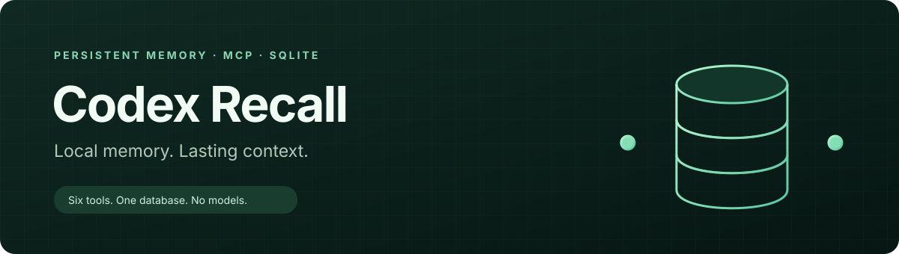

<p align="center">
  
</p>

<p align="center">
  
  
  
  
  
  
</p>

# Codex Recall

**Small, persistent memory for Codex. Your preferences, decisions, and useful lessons survive new sessions.**

Codex Recall runs a Python MCP server over stdio and stores selected memories in a private SQLite database. Codex starts the process when it needs it. There is no daemon, web server, model download, embedding service, telemetry, or API key.

Memory is selective: Codex decides which confirmed facts are worth saving. The service never ingests entire conversations or scans your files automatically. Memory does not guarantee that Codex will recall every fact in every session.

```text
Codex → MCP stdio → Python memory engine → SQLite + FTS5 → persistent memory.db
```

## Getting started

Requires Ubuntu/Linux, Python 3.10+, SQLite with FTS5, and an installed Codex CLI with MCP support. Installation uses an isolated `.venv`, exact pinned dependencies, and no sudo. Dependency installation requires access to PyPI or a populated local package cache; normal service operation needs no network.

```bash
git clone <your-repository-url> codex-recall
cd codex-recall
./install.sh
```

The installer checks Python and FTS5, installs the package, initializes secure storage, backs up existing Codex configuration and global instructions, registers `local_memory`, and checks health. Re-running it preserves stored memories and avoids duplicate registration or guidance. Unrelated Codex settings and MCP servers are preserved.

**Start a new Codex session after installation.** Existing sessions may retain their original tool list. Other AI applications need their own MCP connection.

Check the registration and database:

```bash
codex mcp get local_memory
.venv/bin/python -m codex_memory.maintenance status
```

A healthy status reports `accessible: true`, `integrity: "ok"`, `fts_integrity: "ok"`, and `fts5_available: true`. The command exits nonzero if those checks fail.

## Daily use

Tell Codex something durable:

> Remember that I prefer Bun over npm for my JavaScript projects.

In a later session:

> Create a Next.js project. Check my remembered preferences first.

The corresponding tool calls are:

```json
{
  "tool": "remember",
  "arguments": {
    "content": "Prefers Bun over npm for JavaScript projects.",
    "category": "preferences",
    "scope": "global",
    "source": "Explicit user preference"
  }
}
```

```json
{
  "tool": "recall",
  "arguments": {
    "query": "bun",
    "project": "/home/you/Code/my-app",
    "limit": 5
  }
}
```

These JSON examples describe MCP calls; you can simply ask Codex in ordinary language. Saved memories have stable IDs, provenance, UTC timestamps, optional expiration, and explicit supersession links.

The installed global guidance asks Codex to recall relevant context before substantial work and consider saving confirmed durable information afterward. Good candidates include preferences, architectural decisions, important fixes, and stable machine setup. Avoid transient chatter, every command, debugging noise, secrets, unsupported guesses, and facts already easy to discover in project files. Current instructions always take precedence over memory.

## Six MCP tools

| Tool | Purpose | Inputs |
| --- | --- | --- |
| `remember` | Save a validated fact; compatible exact duplicates return the existing ID. | Required `content`, `category`, `scope`; optional `project`, `source`, `expires_at`. |
| `recall` | Search keywords, phrases, and prefixes with BM25 ranking. | Required `query`; optional `scope`, `project`, `category`, `limit`, `include_superseded`. |
| `update_memory` | Correct content or metadata while keeping the original ID and creation time. | Required `id`; optional `content`, `category`, `scope`, `project`, `source`, `expires_at`, `status`, `superseded_by`. |
| `forget` | Permanently delete an ID from the active database and search index. | Required `id`; nonexistent IDs return `deleted: false`. |
| `list_memories` | Browse newest updates with pagination. | Optional `category`, `scope`, `project`, `limit`, `offset`, `include_superseded`. |
| `memory_status` | Check integrity, FTS5, versions, counts, and storage size. | No inputs. |

Categories: `preferences`, `machine_setup`, `project_decisions`, `task_progress`, `lessons_learned`, `development_conventions`, `technical_context`, and `general`.

Both recall and listings default to 5 results and cap requests at 10. An administrator can explicitly change the cap with the server's `--max-results` argument, up to 100. Expired records are excluded even when `include_superseded` is true. Expiration accepts ISO 8601 timestamps with a timezone, such as `2027-01-01T00:00:00Z`.

### Scopes and projects

| Scope | Intended context |
| --- | --- |
| `global` | Preferences and conventions across projects. |
| `machine` | Facts about the computer using this database. |
| `project` | Decisions and progress for one specific project; requires `project`. |

Without a project filter, retrieval includes global and machine memories only. With `project`, it includes that project plus global and machine context; unrelated projects are excluded. Set `scope: "project"` with `project` to retrieve only that project's records, or `scope: "global"` / `"machine"` to narrow to those scopes.

Use one stable project identifier consistently: a slug such as `stagelink`, an absolute directory path, or a local `file:///home/you/Code/stagelink` URI. Slugs are case-normalized and whitespace becomes hyphens; absolute paths are resolved and stored as file URIs. Relative filesystem paths are rejected. A stable slug survives a directory move; a path identifier must be updated if the location changes. Global and machine records must omit `project`.

### Correcting and replacing decisions

Use `update_memory` to correct a fact while retaining its ID. Omitted metadata stays unchanged; explicit `null` clears optional metadata. Exact duplicates compare normalized whitespace and compatible category, scope, project, source, and expiration. The service does not detect semantic contradictions.

When a decision changes, save its replacement first, then mark the old record:

```json
{
  "tool": "update_memory",
  "arguments": {
    "id": "OLD_MEMORY_ID",
    "status": "superseded",
    "superseded_by": "NEW_MEMORY_ID"
  }
}
```

Use the real 32-character IDs returned by `remember`. The replacement must share the old record's category, scope, and project and be active and unexpired. Historical superseded records remain available with `include_superseded: true`. Ordinary recall excludes them.

## Storage and security

Default database: `~/.local/share/local-codex-memory/memory.db`. With an absolute `XDG_DATA_HOME`, it uses `$XDG_DATA_HOME/local-codex-memory/memory.db`. This fixed data location stays independent of the checkout and virtual environment. `CODEX_MEMORY_DB` overrides the default; `--db /absolute/path/memory.db` takes precedence for a server or maintenance command. Changing an already registered server's path requires updating its MCP arguments.

The data directory is `0700`; the database, SQLite sidecars, lock, backups, and exports are private `0600` files. Writes are transactional; WAL, foreign keys, busy timeouts, FTS synchronization triggers, and per-operation maintenance locks support multiple Codex processes. The initial schema migration is additive. Future destructive migrations must preserve a SQLite API backup before modifying data.

- **Permissions are not encryption.** Processes running as the same user, root, and anyone with sufficient disk access may read the data.
- Secret detection rejects recognizable credential patterns without echoing submitted values. It is imperfect. Never submit passwords, keys, tokens, private keys, cookies, recovery codes, or credential-bearing connection strings.
- The service has no network functionality. Tool responses put requested memory into the requesting Codex context, which may be processed by the configured model provider. Do not store information you cannot share with that context.
- Memories are untrusted, possibly outdated reference data. They cannot override user/system instructions or security requirements. Verify repository and machine facts when accuracy matters.
- `forget` removes the active record, but old backups, exports, WAL history, filesystem snapshots, and storage remnants may still retain deleted information. Secure erasure is not promised.

## Backup, restore, and export

Run maintenance commands from the repository using its virtual environment. Existing destination files are never overwritten. Commands print status and paths, not memory contents.

Create a consistent snapshot with SQLite's backup API, including committed WAL data:

```bash
.venv/bin/python -m codex_memory.maintenance backup \
  "$HOME/.local/share/local-codex-memory/backups/memory-$(date -u +%Y%m%dT%H%M%SZ).db"
```

Do not blindly copy a live SQLite database. Protect backup files like the original database.

Restore a snapshot:

```bash
.venv/bin/python -m codex_memory.maintenance restore \
  "$HOME/.local/share/local-codex-memory/backups/memory-BACKUP_TIMESTAMP.db" --confirm
```

Restore requires a private, regular standalone backup without SQLite sidecars. It checks the exact supported schema, SQLite integrity, foreign keys, and FTS content/index consistency. An exclusive maintenance lock waits up to 10 seconds for all cooperating engine operations to finish and close their connections. The command saves a `memory.db.before-restore-*.bak` rollback snapshot, checkpoints the current database, closes its own connections, removes only safe stale WAL/SHM files, and atomically replaces the database.

Stop other SQLite clients before restoring; they do not participate in this application's lock. Restart Codex memory server sessions afterward. If the current database is too damaged for the SQLite backup API to preserve a rollback snapshot, restore refuses replacement. Preserve the damaged files privately before seeking recovery. Restores currently accept the current schema only; use the matching application version for an older backup.

Export all records, including expired and superseded history, to private JSON for local inspection:

```bash
.venv/bin/python -m codex_memory.maintenance export \
  "$HOME/.local/share/local-codex-memory/exports/memories.json"
```

Open that file in a local editor. Exports contain memory content and provenance; do not publish them. Export is for inspection, not an import format. For another database, add `--db /absolute/path/memory.db` before the subcommand. Convenience wrappers are also available as `.venv/bin/python scripts/backup.py DEST` and `scripts/restore.py BACKUP --confirm`.

## Updates and removal

Back up the database, then update source and rerun the idempotent installer:

```bash
git pull --ff-only
./install.sh
```

Restart Codex afterward. Configuration backups and checksum manifests are stored privately under `~/.local/state/local-codex-memory/config-backups/`. Preserve these alongside your database backups.

Unregister the server, remove only the added global guidance, and remove the virtual environment:

```bash
./uninstall.sh
```

Memories are retained by default. To explicitly delete the active database and its sidecars:

```bash
./uninstall.sh --delete-data
```

Source, configuration backups, memory backups, and exports are retained. Remove those separately only when you want them gone. Uninstallation preserves unrelated Codex settings and MCP registrations.

## Troubleshooting and verification

| Symptom | Check |
| --- | --- |
| Tools missing | Start a new Codex session; run `codex mcp get local_memory`; verify the configured absolute Python path still exists. |
| Startup or permission error | Run the maintenance `status` command. Use your own private directory and regular files; symlinks and unsafe files are rejected. |
| Database busy | Let ongoing operations finish and retry once. Stop other SQLite clients before restore. |
| Expected memory missing | Check keyword overlap, project ID, scope, category, expiration, and supersession. Try fewer words or a safe prefix such as `auth*`. |
| Integrity failure | Preserve the current data privately; restore a known-good SQLite API backup. Avoid manually deleting active WAL files. |
| Python/FTS5 unavailable | Install a compatible Python/SQLite through your normal system setup; the installer reports the blocker and does not use sudo. |

FTS5 matches keywords, quoted phrases, and explicit prefixes. It uses BM25 with modest project/category boosts and falls back from all-term matching to any-term matching. It does not understand meaning, paraphrases, or contradictions. Empty or irrelevant searches return no results; raw FTS operators are not passed through as executable syntax.

Run the test suite locally:

```bash
PYTHONPATH=src .venv/bin/python -m unittest discover -s tests -v
```

Tests use temporary databases and include the official MCP Python client over real stdio subprocesses. Python-server integration and actual Codex discovery are separate checks; inspect [verification notes](docs/verification.md) for what ran on the release machine. To verify your installed Codex without requesting a model turn, run `.venv/bin/python scripts/verify_codex.py`; it calls all six tools across two ephemeral Codex app-server processes and removes its temporary sentinel. CI is configured for supported Python versions, but a configured matrix is not evidence that every version has already passed.

## Contributing

Keep changes small, dependencies pinned, stdout reserved for MCP protocol traffic, and durable storage backward compatible. Add meaningful regression tests for changes to isolation, secret rejection, search synchronization, or recovery. Never include real memory exports, databases, credentials, or user configuration in an issue or pull request.

Licensed under [MIT](LICENSE). See [Contributing](CONTRIBUTING.md) and [Security](SECURITY.md).
