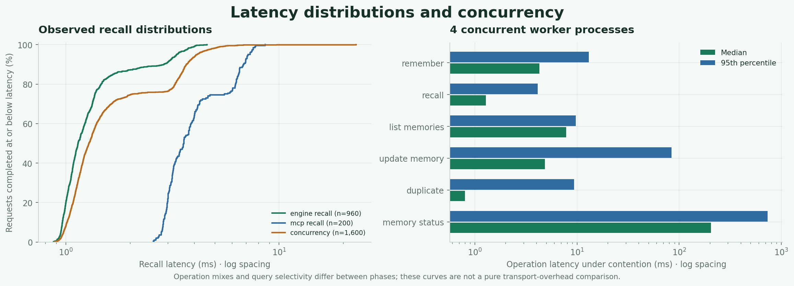

# Measured benchmark results

Codex Recall completed **15,160 timed operations with zero measured errors** on
a generated 10,000-memory corpus. Warm keyword recall remained in the low
milliseconds. Concurrent writes showed much longer tail latencies, and queries
without words shared with their target failed to retrieve it.

This run took place on **9 October 2026**, using Codex Recall 1.0.0, Python
3.10.12, SQLite 3.37.2, MCP SDK 1.30.0, and one Linux x86-64 machine reporting
eight logical CPUs. These are actual measurements for an authored workload,
with ordinary warm operating-system caches. They do not establish performance
on other machines or general search accuracy.

See the [methodology and reproduction commands](benchmark-methodology.md).
The [offline report](../verification/benchmark/latest/charts/benchmark-dashboard.html)
lets you filter the query cases after downloading and opening the HTML file.

## Workload

The seed `20261009` generated 61 labelled fixtures and 9,939 background memories
across six projects, all three scopes, and eight categories. Background records
repeat technical vocabulary and include long distractors. The same nested
corpus was measured at four sizes with 20 warm-up and 240 timed recalls each.

The main run recorded 10,000 committed `remember` calls, 960 engine recalls,
200 MCP recalls, and 4,000 mixed operations from four worker processes. Its
96.02-second duration also includes startup and untimed correctness checks.
Retrieval evaluation used the preserved **10,000-row baseline**. The separate
stress database finished with **11,201 rows** after adding 1,200 worker records
and one shared record. All data and databases were isolated from personal
memory storage.

Raw evidence: [performance metrics](../verification/benchmark/latest/metrics.json),
[latency samples](../verification/benchmark/latest/latency.csv),
[scale CSV](../verification/benchmark/latest/scale.csv), and
[generated corpus](../verification/benchmark/latest/corpus.jsonl).

## Engine scaling

| Memories | Recall p50 | Recall p95 | Recall p99 | Storage | New records/s |
| ---: | ---: | ---: | ---: | ---: | ---: |
| 100 | 1.01 ms | 1.45 ms | 1.76 ms | 0.20 MiB | 137.09 |
| 1,000 | 1.19 ms | 1.64 ms | 1.83 ms | 1.21 MiB | 136.86 |
| 5,000 | 1.21 ms | 3.61 ms | 4.09 ms | 5.54 MiB | 131.67 |
| 10,000 | 1.24 ms | 3.72 ms | 4.03 ms | 11.03 MiB | 133.76 |

Each latency includes the public engine operation and its connection lifecycle.
Storage includes the database and live SQLite sidecars. Ingestion rates cover
new records in each segment, with two extra supersession updates included in
the first segment's elapsed time. Individual serial inserts had p50 **7.26 ms**,
p95 **9.08 ms**, and p99 **12.51 ms**.

Percentiles use nearest rank. Each scale has 240 samples, so its p99 is the
third-highest observation; this is not an estimate of rare worst-case latency.

## MCP stdio

| Measurement | Observed result |
| --- | ---: |
| Spawn through initialized SDK session | 831.94 ms, one sample |
| Timed warm recalls | 200 |
| Recall p50 / p95 / p99 | 3.56 / 7.17 / 7.70 ms |
| Maximum recall | 8.60 ms |

These calls used the official MCP Python client and an actual server subprocess
against the 10,000-record database. They include protocol handling and tool
dispatch. The startup observation excludes the first recall and does not
describe a cold disk cache. All six tools were discovered and exercised.

## Contention

Four independent processes completed **4,000 operations in 13.98 seconds**, or
**286.09 successful operations/s**, including process startup and shutdown.
Attempted and successful throughput were equal because no operation failed.
These workers called the engine directly; they were not four MCP clients.

| Operation | Samples | p50 | p95 | p99 | Maximum |
| --- | ---: | ---: | ---: | ---: | ---: |
| New memory | 1,200 | 4.28 ms | 13.01 ms | 183.17 ms | 1,035.94 ms |
| Recall | 1,600 | 1.28 ms | 4.11 ms | 5.27 ms | 23.00 ms |
| List memories | 600 | 7.83 ms | 9.76 ms | 11.79 ms | 16.05 ms |
| Update | 400 | 4.84 ms | 83.86 ms | 533.64 ms | 735.51 ms |
| Shared duplicate attempt | 160 | 0.80 ms | 9.39 ms | 530.37 ms | 930.89 ms |
| Integrity status | 40 | 205.18 ms | 733.87 ms | 1,718.82 ms | 1,718.82 ms |

The fixed mix was 30% inserts, 40% recalls, 15% listings, 10% updates, 4%
duplicate attempts, and 1% status calls. SQLite serializes writers, so low
median write latency did not prevent substantial contention delays. Status
performs SQLite and FTS integrity checks; it should not be treated as a cheap
request to issue on every recall. The status p99 equals its maximum because
there were only 40 samples.

The engine curve pools all four scales. The phases differ in dataset size,
sampling, and surrounding work, so subtracting their medians would not isolate
MCP transport overhead.

## Target retrieval

The suite was frozen before its outcomes were observed: **80 authored queries
against 44 distinct target facts**. Hit@1 and hit@5 ask whether the designated
target appeared first or within five results. MRR@5 averages its reciprocal
rank, using zero for a miss.

| Query type | Queries | Target at rank 1 | Target in top 5 | MRR@5 |
| --- | ---: | ---: | ---: | ---: |
| Exact keyword | 8 | 8/8 | 8/8 | 1.000 |
| Quoted phrase | 10 | 10/10 | 10/10 | 1.000 |
| Multiple terms | 10 | 10/10 | 10/10 | 1.000 |
| Prefix | 8 | 8/8 | 8/8 | 1.000 |
| Context filter | 12 | 12/12 | 12/12 | 1.000 |
| Malformed syntax and Unicode | 10 | 10/10 | 10/10 | 1.000 |
| Paraphrase with shared words | 12 | 10/12 | 11/12 | 0.875 |
| Paraphrase without word overlap | 10 | 0/10 | 0/10 | 0.000 |

Across this particular mix, hit@1 was **68/80 (85%)**, hit@5 **69/80 (86.25%)**,
and MRR@5 **0.85625**. The 58 lexical cases all ranked their target first.
One shared-word question about npm missed its target; a backup question placed
its target second. All ten questions without indexed-word overlap missed.

The queries were manually composed from synthetic facts, reuse some targets,
and do not label every potentially relevant result. These scores cannot
establish exhaustive recall, precision, or semantic accuracy. Keyword OR
fallback can return other records when the intended target is absent.

Inspect the [frozen labels](../scripts/recall_queries.json),
[quality report and failures](../verification/benchmark/latest/quality.json),
and [per-query CSV](../verification/benchmark/latest/query_results.csv).

## Correctness and recovery

| Check | Result |
| --- | --- |
| Context and lifecycle checks | 29/29 passed |
| Returned-row inspections | 1,311; zero observed scope, project, category, expiration, or supersession leaks |
| Negative and input-validation cases | 6/6 passed; three broad queries were reported without target scores |
| Concurrent writes and updates | 1,200 unique records and 400 updates completed |
| Concurrent shared duplicate attempts | 160 attempts; one new ID and 159 duplicate hits |
| Database counts and constraints | Expected 11,201 rows; distinct IDs match, no active duplicate groups or foreign-key errors |
| SQLite and FTS integrity | Healthy in MCP checks, concurrent status calls, and the restored database |
| Acknowledged commit after `SIGKILL` | Record retrieved after restarting the benchmark's own server |
| Backup and restore | All 11,201 durable rows matched; sampled search matched |
| Synthetic credential rejection over MCP | 5/5 rejected without echoing the submitted value |

Backup took **247.85 ms** and restore **456.94 ms** for an **11.96 MiB** snapshot.
The crash check covered an acknowledged committed write, not power loss or an
interrupted transaction. Credential rejection covers these synthetic examples;
it does not prove every secret format can be detected. The row inspections are
repeated observations, not 1,311 distinct records.

See [operation checks](../verification/benchmark/latest/operation_checks.json)
for the recorded invariants. Independent recomputation verified raw quantiles,
workload counts, target ranks, aggregates, and baseline row identity. A separate
100-record CLI smoke run also passed 340 timed operations with correct scale
labels and expected final counts.

The [regression check](../verification/benchmark/latest/unit_test_result.json)
passed **71 tests** and compiled the benchmark scripts. The
[isolation check](../verification/benchmark/latest/isolation_check.json)
confirmed a separate benchmark database and unchanged durable rows in the
configured personal-memory database. The
[Chrome dashboard check](../verification/benchmark/latest/dashboard_checks.json)
verified all 80 query rows, the 11 top-five misses, case evidence, no JavaScript
errors, and no page overflow at mobile width. The
[CLI validation record](../verification/benchmark/latest/cli_validation.json)
also covers rejection of invalid limits and reuse of an existing run directory.

## Server memory

A separate new MCP process was measured directly through Linux `/proc` against
the baseline after 20 warm-up and 200 further recalls:

| Server phase | Current RSS | Process high-water value |
| --- | ---: | ---: |
| Initialized, before queries | 50.63 MiB | 50.63 MiB |
| After recalls | 51.84 MiB | 53.32 MiB |
| After integrity check | 51.84 MiB | 53.37 MiB |

Maximum RSS sampled between recall calls was **52.32 MiB**. The process closed
after the profile. RSS includes shared pages; these observations do not equal
private RAM usage or whole-system memory. The retained `resource.ru_maxrss`
counter in the main report inherited its launcher's earlier high-water value
and cannot measure this service's footprint. Actual peak memory for the
original benchmark process is unavailable.

Raw evidence: [server memory profile](../verification/benchmark/latest/memory_profile.json).
The extra profiling calls are excluded from the main 15,160-operation total.
